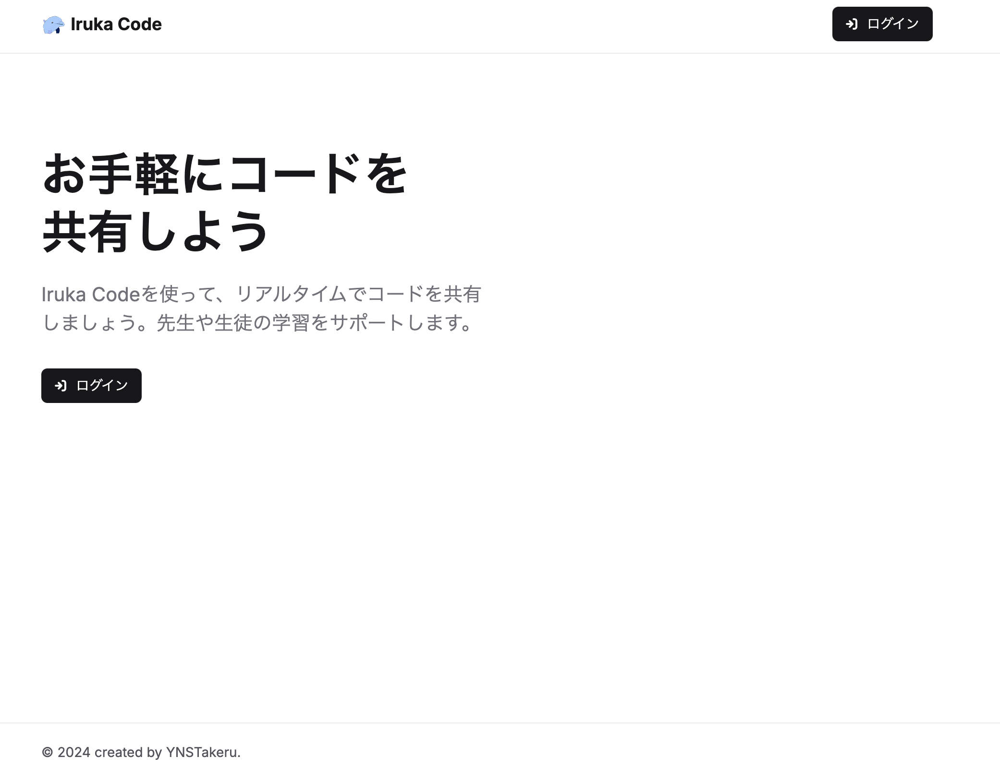
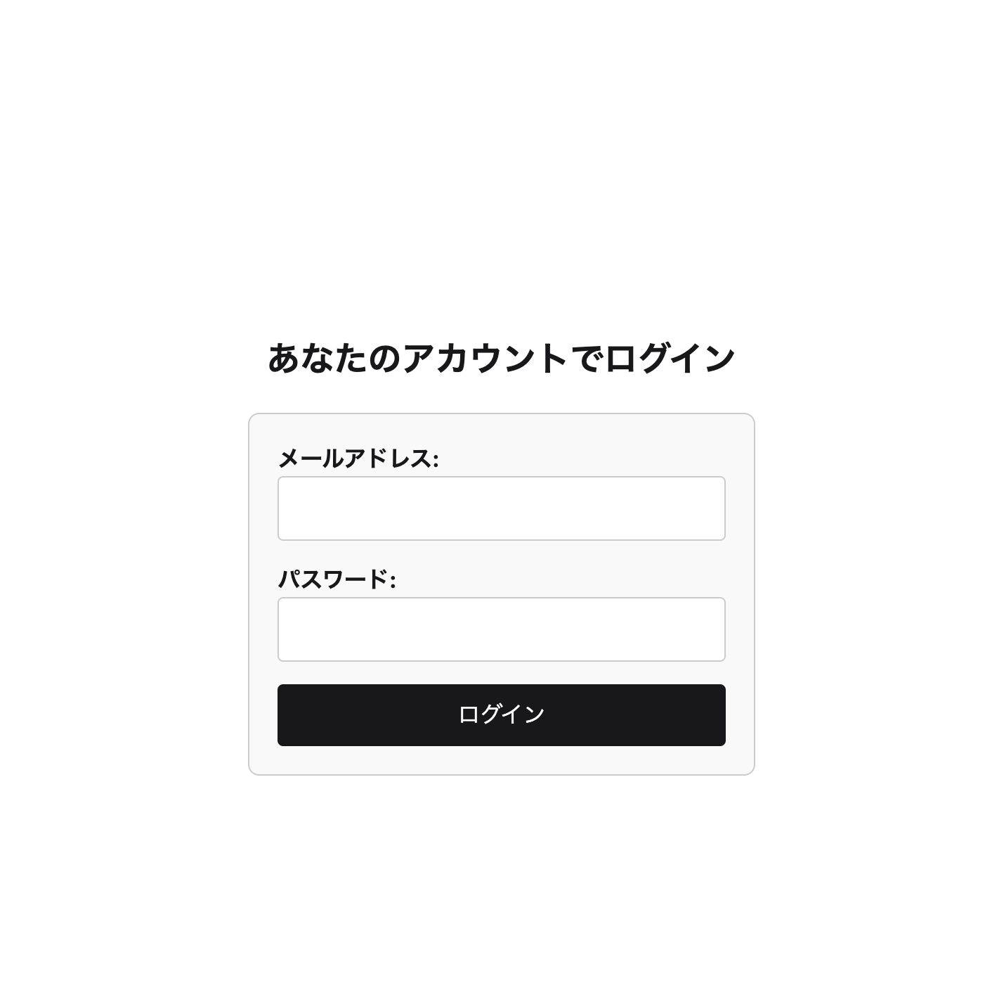
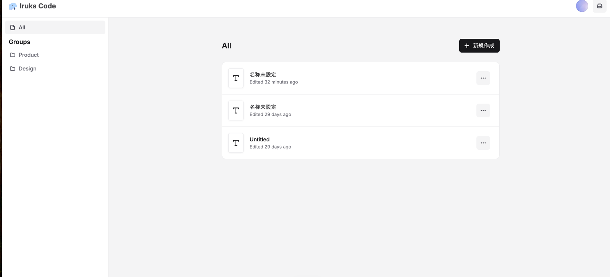
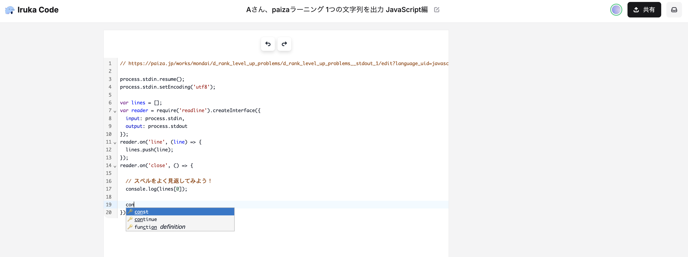
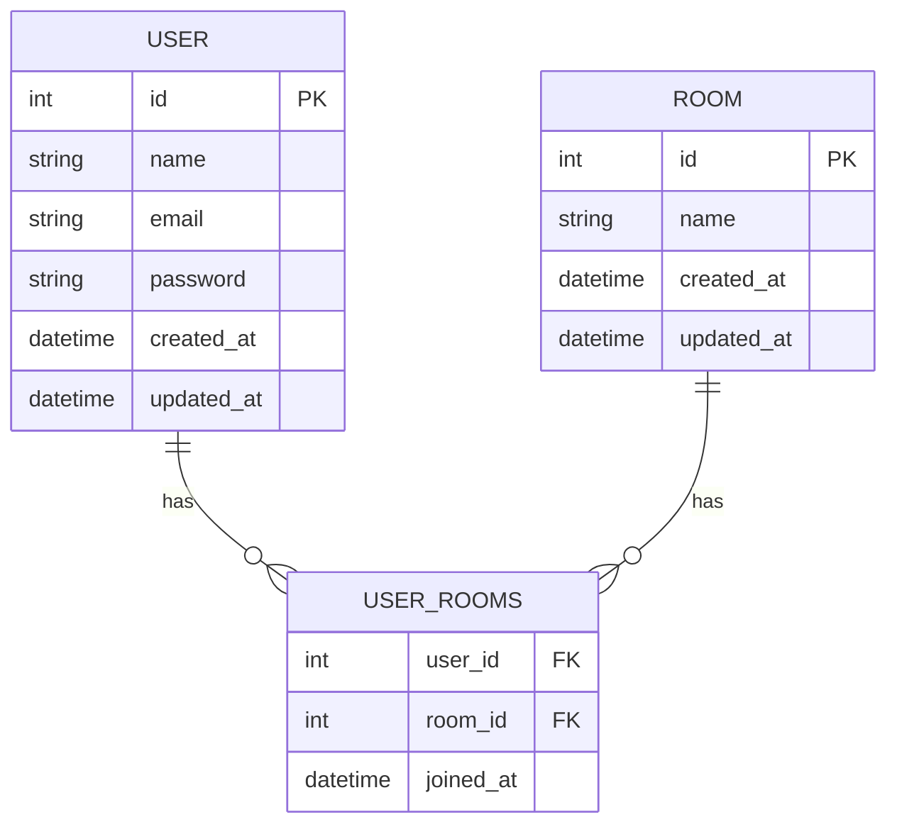
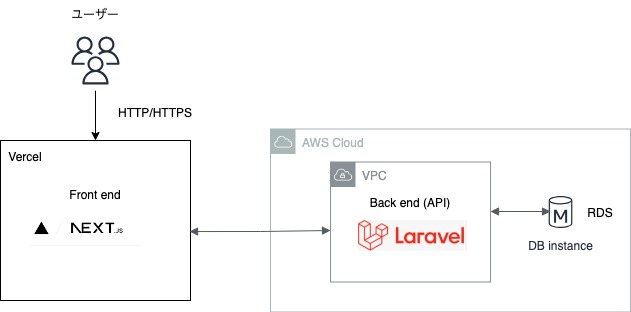

# Iruka Code

## 概要
『Iruka Code』はプログラミング学習初心者の為の学習支援サービスです。

ブラウザだけでプログラミングを学びたい初心者のコードをリアルタイムで閲覧、編集することができます。

 ## オリジナルプロダクトのURL
 [ユーザーとしてアクセスする](https://iruka-code.vercel.app/text/m9btARdR9GuCVSiVHDwRA)

 [トップページはこちら](https://iruka-code.vercel.app/)

## 画面キャプチャ
### トップページ

### ログイン画面

### ダッシュボード

### コーディング共有画面

## 使用技術
- フロント
    - Next.js 14.1.4
    - codemirror 6.0.1
    - TypeScript 5.4.3
    - コード解析ツール
        - ESLint 8.47.0
        - Prettier 3.0.1
- バックエンド
    - PHP 8.2.24
    - Laravel 10.48.22

- インフラ・開発環境
    - AWS (EC2,VPC,RDS)

## ER図

## インフラ構成図

## 機能一覧
- ログイン機能
- JavaScriptコード共有編集機能
- JavaScript syntax highlight機能
- JavaScript コード補完機能
